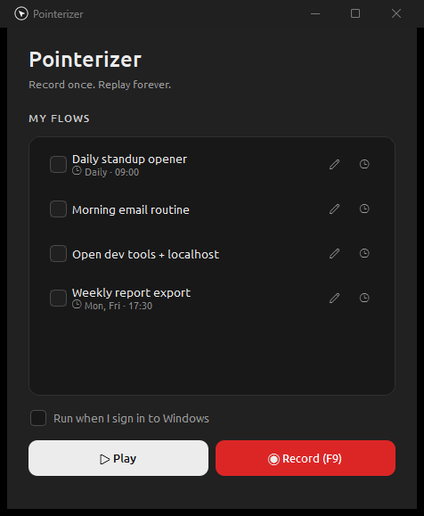

Record mouse + keyboard actions on Windows, replay them on demand or on a schedule.

<p align="center"></p>

## Install

Download **PointerizerSetup.exe** from the [latest release](https://github.com/Z4ffarani/Pointerizer/releases) and run it. It's a per-user install — no admin prompt, adds a Start Menu entry and an uninstaller. (It's unsigned, so on first run Windows SmartScreen may warn: **More info → Run anyway**.)

Your recordings are plain JSON in a `recordings\` folder next to the app.

## Use

**Record** — hit **Record (F9)** (or just press **F9**). The cursor centers, the screen gets a red border, and a draggable pill appears. Everything you do is captured: clicks, drags, typed text (accents included), hotkeys (Ctrl+C…), a lone **Windows key**, and scrolling. When you finish, a popup asks for a name — **Enter** accepts the dated default, or type your own.

- **F8** — checkpoint: pause and review actions since the last one. F8 again continues; **F7** deletes the last action; **F9** stops & saves. (These work globally.)
- Drag the pill mid-flow to pause at a checkpoint; the drag time isn't recorded.

**Play** — click a recording and hit **Play**, or double-click it. You get 2 seconds to bring your target window to front, then it replays with the original timing (the pointer glides to each target). Playback also starts from a centered cursor. **Abort** anytime with **Esc** or by slamming the mouse into a screen corner.

**Select & delete** — tick a flow's **checkbox** (click again to unselect); **Shift+click** a checkbox to select a range. A red **trash icon** appears top-right — click it (or press **Del**) to delete the selected flows. Each row also has **pencil** (rename) and **clock** (schedule) icons.

## Scheduled runs

- **Run at sign-in** — tick **"Run when I sign in to Windows"** (drops a launcher in your Startup folder). Only one flow can hold the sign-in slot at a time.
- **Run at set times** — the **clock icon** creates a Windows Task Scheduler task (hourly/daily/weekly, a start time, and plays-per-run). Reopen the dialog to change or remove it.

Both need you signed in — Windows blocks synthetic input on the lock screen. Recordings are plain JSON, so you can also wire them to Task Scheduler yourself:

```
"C:\path\to\Pointerizer.exe" --play "C:\path\to\recordings\myjob.json" --repeat 3
```

## Limits

Playback replays raw screen coordinates — it needs the same resolution/layout as when recorded, with target windows in the same place. No screen-content recognition.

## Develop

```
pip install -r requirements.txt   # runtime only
python pointerizer.py             # run from source
```

Build the installer (needs `requirements-dev.txt` + [Inno Setup](https://jrsoftware.org/isinfo.php)):

```
pip install -r requirements-dev.txt
winget install JRSoftware.InnoSetup
.\packaging\build.ps1
```

`packaging\build.ps1` runs the self-check, regenerates the icon, and produces `dist\Pointerizer.exe` (PyInstaller) and `dist\PointerizerSetup.exe` (Inno Setup). To ship an update, bump `MyAppVersion` in [packaging/pointerizer.iss](packaging/pointerizer.iss) and rerun it — installing over an older version upgrades in place, and recordings and schedules survive.

### Layout

```
pointerizer.py        the whole app (single file)
assets/               icon, banner, bundled Ubuntu font
packaging/            build.ps1, make_icon.py, Inno Setup script
requirements*.txt     runtime / build deps
```
